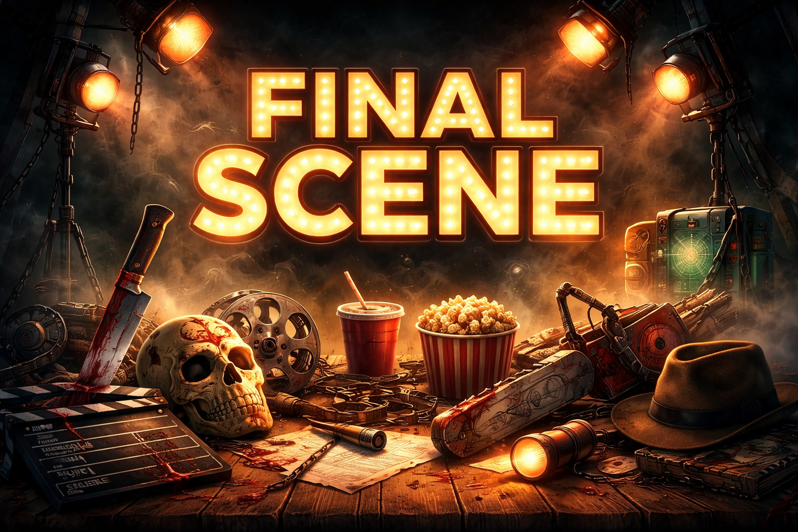
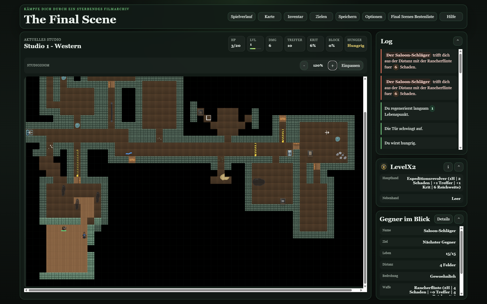

# The Final Scene

Fight Through a Dying Movieverse

Browserbasiertes Rogue-like mit Horrorfilm-Thema, einem prozedural erzeugten Studiokomplex aus einzelnen Studios, zustandsbasiertem Kampf, Loot, Hunger-System, Save/Load und einer recht großen Playwright-E2E-Suite.

## Auf einen Blick

`The Final Scene` ist ein browserbasiertes Solo-Roguelike, in dem du dich durch einen sterbenden Filmkosmos aus thematischen Studios kämpfst. Jeder Run verbindet Erkundung, rundenbasierten Kampf, Loot, Hunger-Management und filmische Genrewechsel zwischen Slasher, Western, Noir, Fantasy, Sci-Fi und weiteren Sets.

Das Projekt richtet sich gerade vor allem an Leute, die Freude an experimentellen Systemen, taktischem Roguelike-Gameplay und einer starken Genre-Idee haben. Es ist bereits gut spielbar, aber bewusst noch in einem frühen Entwicklungsstadium.

## Was dich erwartet

- prozedural erzeugte Studiokomplexe mit verzweigten Pfaden, Türen, Fallen und Sonderräumen
- rundenbasierte Kämpfe mit Waffen, Schilden, Heilung, Effekten und situativen Entscheidungen
- Genre-Sets mit eigener Stimmung, eigenen Gegnern, Props und Item-Identität
- ein Hunger- und Ressourcenmodell, das Runs unter Druck setzt
- Save/Load, Highscores und eine umfangreiche lokale Testbasis

## So spielt es sich

Ein typischer Run beginnt mit einer Klasse, ersten Grundwerten und einem Start-Setup. Danach arbeitest du dich Studio für Studio vor, weichst Gegnern aus oder gehst bewusst in Kämpfe, sammelst Nahrung, Heilung, Ausrüstung und Schlüssel und versuchst, deinen Build an die Situation anzupassen.

Der Reiz entsteht aus der Mischung aus Positionierung, Ressourcenknappheit, Genre-Wechseln und improvisierter Taktik. Du sollst nie nur den einen richtigen Build finden, sondern mit dem arbeiten, was der Run dir gibt.

## Entwicklungsstatus

Aktuelle Vorabversion: `0.1.0-alpha.1`

Das Projekt ist spielbar und lokal gut abgesichert, aber noch klar im frühen Produktstadium:

- das Kernspiel funktioniert bereits über viele Systeme hinweg stabil
- Balancing, Progressionskurve und Item-/Gegner-Gewichtung sind noch nicht ausgereift
- die langfristige Endstruktur eines Runs ist noch offen
- Endherausforderungen, Endgegner und ein endgültiger Abschlusszustand werden noch weiterentwickelt

Wer sich das Repository ansieht, sollte es deshalb als aktives Pre-Release verstehen, nicht als inhaltlich abgeschlossene Version.

## Projektregeln

- Sichtbare deutsche UI-Texte verwenden echte Umlaute und ß.
- ASCII-Schreibweisen wie `ae`, `oe` oder `ue` sind nur für technische Bezeichner, IDs und Dateinamen gedacht.
- Archetypen werden in der UI als klare Einzelbegriffe angezeigt, nicht als mehrteilige Designbeschreibung.

## Begriffe

- `Dungeon` meint in der Doku den gesamten Studiokomplex eines Runs.
- `Studio` meint die einzelne bespielte Einheit; ältere Formulierungen wie `Level` oder `Ebene` sind dafür nicht mehr die bevorzugten Begriffe.

## Kurzüberblick

Dieses Repository enthält ein lauffähiges Einzelspieler-Browserspiel ohne Framework. Die App besteht aus statischem HTML/CSS und modularisiertem JavaScript im `src/`-Ordner. Für den Browser wird der aktive Einstieg `src/main.mjs` per `esbuild` nach `dist/game.bundle.js` gebündelt. `index.html` lädt genau dieses Bundle.

Wenn du neu in das Projekt kommst, ist die wichtigste Orientierung:

- Aktiver Runtime-Pfad: `src/main.mjs`
- Aktive Architektur: `src/app/`, `src/application/`, `src/ui/`, `src/content/` plus fachliche Module wie `dungeon.mjs`, `combat.mjs`, `ai.mjs`, `items.mjs`
- Browser-Einstieg: `index.html`
- Build-Artefakt: `dist/game.bundle.js`
- E2E-Tests: `tests/*.spec.js`
- Legacy-Referenzen: `src/legacy/main.mjs`, `src/legacy/dom.mjs`, `src/legacy/render.mjs`, `src/legacy/state.mjs`

Die Legacy-Dateien liegen getrennt unter `src/legacy/`. Der aktive Produktivpfad läuft über `src/main.mjs` und die darunter verdrahteten Module.

## Projektstatus

Stand jetzt ist das Projekt spielbar und die vorhandene Verifikation läuft lokal sauber:

- `npm run check:js`
- `npm run build`
- `npm run lint`
- `npm run test:e2e`

Die Playwright-Suite deckt Startflow, Navigation, Kampf, Loot, Hunger, Persistenz, Türen/Schlüssel, Fallen, Showcase-Objekte und mehrere Smoke-Checks gegen den produktiven Laufzeitpfad ab.

Versionierung aktuell:

- `0.1.0-alpha.1` entspricht dem ersten öffentlichen Pre-Release-Stand
- größere spielerische und strukturelle Änderungen sind vor `1.0` ausdrücklich zu erwarten

## Schnellstart

1. Abhängigkeiten installieren: `npm install`
2. Browser-Bundle bauen: `npm run build`
3. Lokalen App-Server starten: `npm run start:app`
4. `http://127.0.0.1:4173` im Browser öffnen

Für OpenAI-TTS optional:

1. `.env.example` nach `.env` kopieren
2. `OPENAI_API_KEY` in `.env` setzen

Ohne API-Key nutzt die App für Studioansagen automatisch weiter die Browser-Stimme als Fallback.

Für E2E-Tests:

1. `npm run test:e2e`

Das Test-Setup startet selbst einen lokalen Server auf Port `4173`.

## Wichtige Skripte

- `npm run build`
  Bündelt `src/main.mjs` nach `dist/game.bundle.js`.
- `npm run check:js`
  Führt Syntax-Prüfungen für den aktuell konfigurierten Satz an Kernmodulen aus.
- `npm run lint`
  Führt statische JavaScript-Prüfungen über den aktiven Projektpfad aus und ergänzt `check:js` um Qualitätsregeln jenseits reiner Syntax.
- `npm run lint:fix`
  Wendet automatisch behebbare ESLint-Korrekturen an.
- `npm run start:test`
  Startet den lokalen Test-/App-Server auf Port `4173` und deaktiviert im ausgelieferten Browser-Testmodus Studio-Sprachausgaben automatisch vor dem App-Start.
- `npm run start:app`
  Baut das Bundle und startet den lokalen App-Server auf Port `4173`.
- `npm run test:e2e`
  Baut das Projekt und startet danach die Playwright-Suite.

## So ist das Projekt aufgebaut

### Laufzeit

- `index.html`
  Definiert die komplette UI-Struktur, Modals und Mount-Punkte.
- `styles.css`
  Gesamtes visuelles Styling der App.
- `src/main.mjs`
  Schlanker Composition Root der Anwendung. Hier werden vor allem `app-config`, `app-ui`, Factories, Assemblies und der aktive Runtime-Kontext zusammengesetzt.
- `src/app/`
  Bootstrap, Assemblies, `app-config`, `app-ui`, Factory-Sammlung, Render-Zyklus, Startflow, UI-Preferences und Runtime-Helfer.
- `src/application/`
  Application-Services für Savegame, Input, Floor-Wechsel, Item-Flows, Audio und UI-Bindings.
- `src/ui/`
  Board-, HUD-, Inventory-, Tooltip- und Log-Views sowie DOM-nahe UI-Helfer.

### Fachmodule

- `src/data.mjs`
  Zentrale Kataloge und Stammdaten: Tiles, Monster, Waffen, Schilde, Props und weitere Konstanten.
- `src/balance.mjs`
  Balancing-Konstanten und Progressions-/Spawn-Regeln.
- `src/dungeon.mjs`
  Kompositionsschicht für die Erzeugung der Studios im Studiokomplex: branch-basiertes Layout, Studio-Anker, Türen/Schlüsselräume, Chests, Gegner- und Item-Platzierung. Das konkrete Layout sitzt heute vor allem in `src/dungeon/branch-layout.mjs`.
- `src/studio-topology.mjs`
  3D-Studio-Topologie eines Runs: Nachbarschaften zwischen Studios, Ein-/Ausgangsrichtungen sowie Übergangsstile wie Durchgang, Treppe oder Lift.
- `src/combat.mjs`
  Treffer, Krits, Blocken, Schaden, Tod und kampfbezogene Hilfslogik.
- `src/ai.mjs`
  Gegnerverhalten und Verfolgungslogik.
- `src/items.mjs`
  Aufheben, Ausrüsten, Inventarlogik und Item-Verwendung.
- `src/loot.mjs`
  Food-/Loot-spezifische Erzeugung.
- `src/itemization.mjs`
  Raritäten, Affixe/Modifier und Equipment-Rolls.
- `src/traps.mjs`
  Fallenaufbau und Trap-Effekte.
- `src/nutrition.mjs`
  Hunger-/Nahrungsmodell.
- `src/state.mjs`
  Persistenz, Save/Load, Optionen, Highscores und State-Erzeugung.
- `src/render.mjs`
  DOM-Rendering für Board, Log, HUD, Inventar, Gegneransicht und Listen.
- `src/dom.mjs`
  DOM-Bindings für `index.html`.
- `src/test-api.mjs`
  Test-Hooks für Playwright. Die globale API wird nur aktiviert, wenn `localStorage["dungeon-rogue-enable-test-api"] === "1"` gesetzt ist.
- `src/utils.mjs`
  Kleine generische Hilfsfunktionen.

### Tests

- `tests/*.spec.js`
  Fachliche E2E-Szenarien.
- `tests/helpers.js`
  Test-Helfer für Setup, Teleports, Combat-Szenarien und gezielte Platzierung von Objekten.
- `tests/test-setup.js`
  Aktiviert die Test-API explizit für Testläufe.
- `playwright.config.js`
  Konfiguration für Webserver, Base-URL und Output-Verzeichnis.

### Sonstiges

- `assets/`
  SVG-Assets für Monster, Waffen, Schilde, Props, Nahrung und Umgebung.
- `docs/quality-report.md`
  Bisherige Qualitätsanalyse, Findings und Maßnahmen.

## Spielmechaniken in Kürze

- Rundenbasiertes Bewegen per Tastatur
- Zufällig generierte branch-basierte Studios mit Hauptkorridor, Themenräumen, Connector-Räumen, Studio-Ankern, Türen und Sonderobjekten
- Gegner mit unterschiedlichen Verhaltensprofilen
- Waffen, Schilde, Nahrung, Heiltränke, Schlüssel und Truhen
- Hunger-/Nutrition-System mit negativen Folgen bei Vernachlässigung
- Save/Load über `localStorage` mit 10 festen Slots, bewusstem Überschreiben und verbrauchendem Load
- Highscores ebenfalls über `localStorage`

## Steuerung

- `QWE / A D / YXC` oder Pfeiltasten: bewegen, auch diagonal
- `Leertaste`: warten
- `H`: Heiltrank aus dem Inventar trinken
- `V`: benachbarte offene Tür schließen
- `I`: Inventar öffnen
- `O`: Optionen öffnen
- `R`: neuen Lauf starten
- `Enter`: Fund- oder Treppenwahl bestätigen
- `Esc`: offenes Fenster schließen

## Hinweise für neue Threads oder Workspaces

- Lies zuerst diese README und danach [docs/project-overview.md](docs/project-overview.md).
- Für projektbezogenen KI-Kontext und gepflegtes Projektwissen nutze `ai-project-memory/` als primären Einstieg.
- Arbeite standardmäßig gegen den aktiven Pfad aus `src/main.mjs`, `src/app/`, `src/application/`, `src/ui/` und den jeweiligen Fachmodulen, nicht gegen `src/legacy/`.
- Nach Änderungen am Runtime-Code immer mindestens `npm run build` ausführen.
- Bei Spiellogik oder UI-Verhalten möglichst `npm run test:e2e` mitlaufen lassen.
- Wenn etwas im Browser nicht sichtbar wird, ist oft schlicht das Bundle in `dist/` nicht neu gebaut worden.
- Die Tests nutzen überwiegend die explizit freigeschaltete `__TEST_API__`; der normale Produktivpfad soll diese API nicht offenlegen.

## Bekannte strukturelle Realitäten

- Die Codebasis ist inzwischen klar in `app`, `application`, `ui`, `content` und fachliche Kernmodule geschnitten, aber `main.mjs` und `dungeon.mjs` bleiben wichtige Verdrahtungs- bzw. Kompositionspunkte.
- Es existiert bewusst noch eine isolierte Legacy-Linie unter `src/legacy/`.
- Es gibt bereits gute E2E-Abdeckung, aber nur leichtes Build-/Syntax-Tooling. Linting, Formatting und CI sind naheliegende nächste Ausbaustufen.

## Weiterführende Doku

- Architektur- und Arbeitsüberblick: [docs/project-overview.md](docs/project-overview.md)
- Qualitätsanalyse: [docs/quality-report.md](docs/quality-report.md)

## Lizenz

Der Quellcode dieses Projekts steht unter der `PolyForm Noncommercial 1.0.0`-Lizenz.
Eigene nicht-codebezogene Inhalte wie Assets, SVGs und Dokumentation stehen, sofern nicht anders angegeben, unter `CC BY-NC 4.0`.

Kommerzielle Nutzung ist ohne ausdrückliche gesonderte Genehmigung nicht erlaubt.

Siehe dazu:

- [LICENSE](LICENSE)
- [LICENSE-assets.md](LICENSE-assets.md)
- [NOTICE.md](NOTICE.md)
